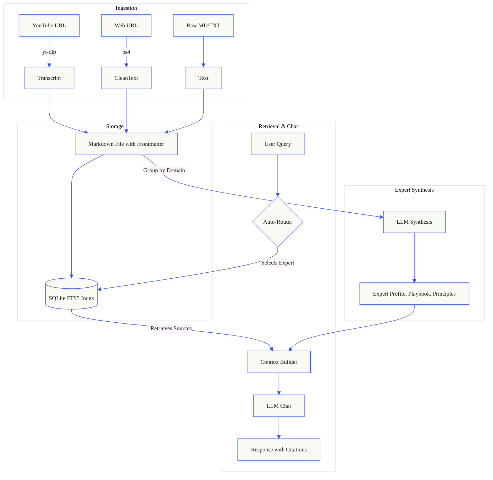

<p align="center">
  
  
  
</p>

# LifeOS

> **A local-first, privacy-respecting Personal Expert Network. Ingest raw notes, web pages, and YouTube transcripts to synthesize personalized AI experts that you can chat with over your own data.**

[](#)
[](https://opensource.org/licenses/MIT)

---

## The Problem
Generic LLMs don't know *your* context. Standard note-taking apps require you to manually organize and search. We needed a system that acts as an intelligent sounding board, specifically trained on the creators, books, and insights we care about, without sending private thoughts to the cloud.

## The Solution
**LifeOS** is a local-first platform that synthesizes **Expert Personas** out of your ingested content.
It builds a local SQLite Full-Text Search index over your data and uses Agentic Routing to answer your questions using the perspective of specific experts, fully citing the source material.

**Key Features:**
- **Local SQLite FTS5 Search** — Lightning fast, completely offline indexing.
- **YouTube & Web Ingestion** — Drop a link, and LifeOS automatically downloads the transcript, parses the HTML, and summarizes it.
- **Expert Synthesis** — Group content by creator/domain. LifeOS auto-generates a `playbook.md`, `principles.md`, and `profile.md` for that expert.
- **Multi-Turn Chat with Citations** — Chat directly with your synthesized experts. Every claim is backed by a specific Markdown note reference.
- **Modular Pipeline** — Built with clean Python. No LangChain bloat. You own the code and the prompts.

---

## Architecture Diagram



---

## 🧭 System Design & Agentic Flow

LifeOS operates on specialized **Experts** rather than a single monolithic chatbot. Each expert is a stateful persona grounded in specific subsets of your knowledge base.

### 1. Separation of Layers
- **System Layer**: Code, system prompts, schemas, and configurations (`src/`, `apps/`, `config/`).
- **User Layer**: Your curated knowledge base, expert profiles, and private resources (`data/`). The application reads the User Layer to construct context but never overwrites human-written files without explicit approval.

### 2. Expert Routing
Queries are routed to experts based on declarative mapping (`config/domain_map.yaml`) and frontmatter tags. If you ask a design question, the system automatically routes it to your curated design expert.

---

## Directory Structure

| Path | Description |
|------|-------------|
| `apps/streamlit-chat/` | The main Streamlit UI. Contains the `app.py` orchestrator and modular `ui/` components (chat, sidebar, modals). |
| `src/core/` | Pure Python business logic: `frontmatter.py`, `youtube.py`, `web.py`, `experts.py`, `ingest.py`. |
| `data/` | Your personal knowledge base. Separated into `knowledge/` (ingested notes), `experts/` (synthesized profiles), and `private/` (your backlog and sensitive data). |
| `config/` | System configurations, domain maps, and model definitions. |
| `.gemini/config/skills/` | Built-in interactive Agent Skills that allow AI coding assistants to interact with the LifeOS API. |

---

## Getting Started

1. **Clone the repository:**
   ```bash
   git clone https://github.com/s-mberli/LifeOS.git
   cd LifeOS
   ```

2. **Install dependencies:**
   ```bash
   pip install -r requirements.txt
   ```

3. **Set your API Keys:**
   Create a `.env` file in the root directory:
   ```env
   OPENAI_API_KEY=your_key_here
   ```

4. **Run the UI:**
   ```bash
   streamlit run apps/streamlit-chat/app.py
   ```
