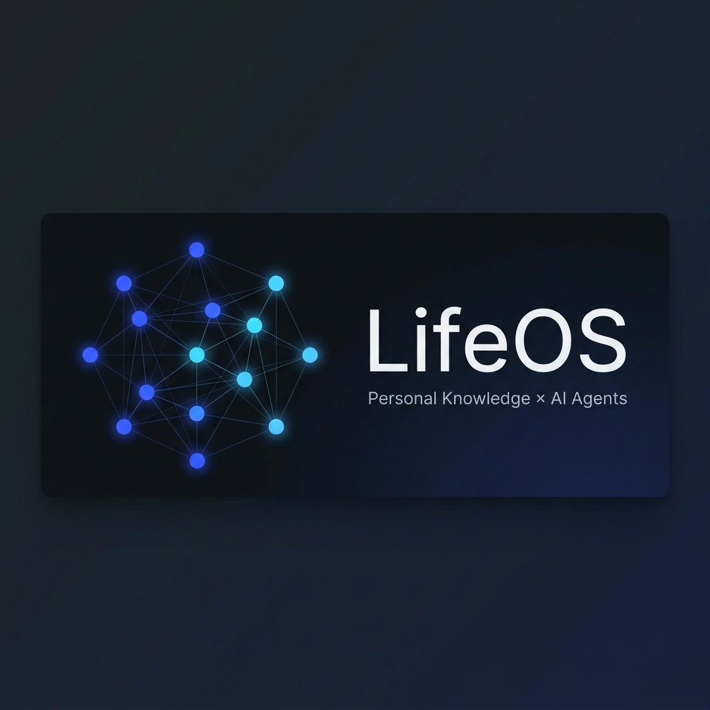
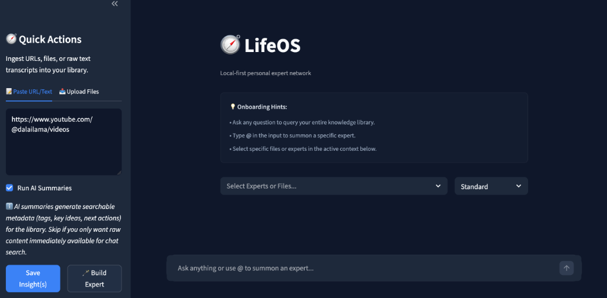
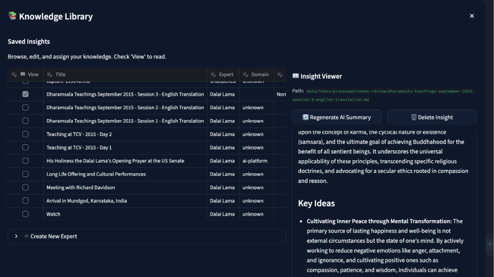
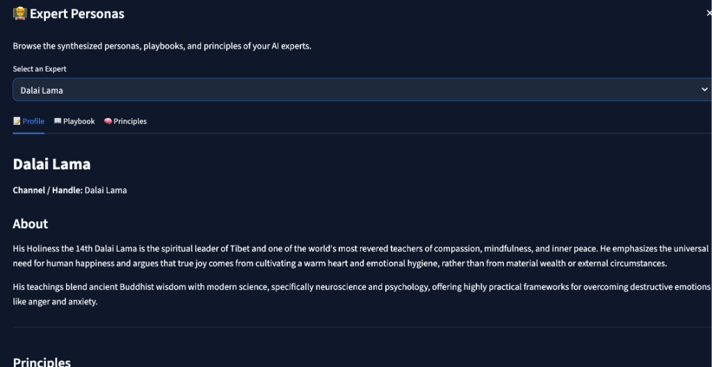
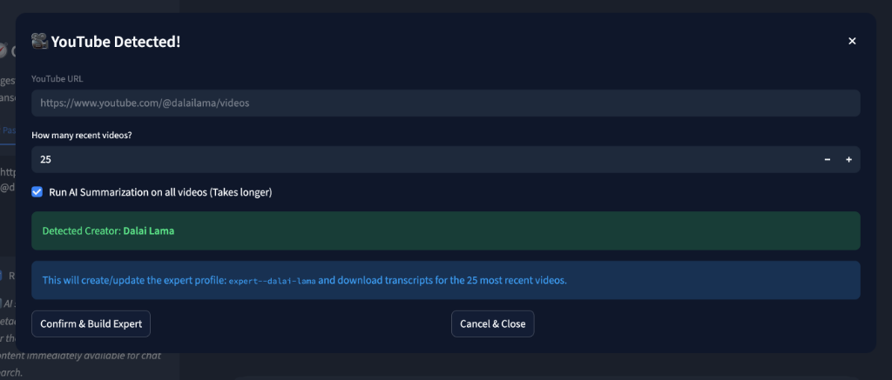
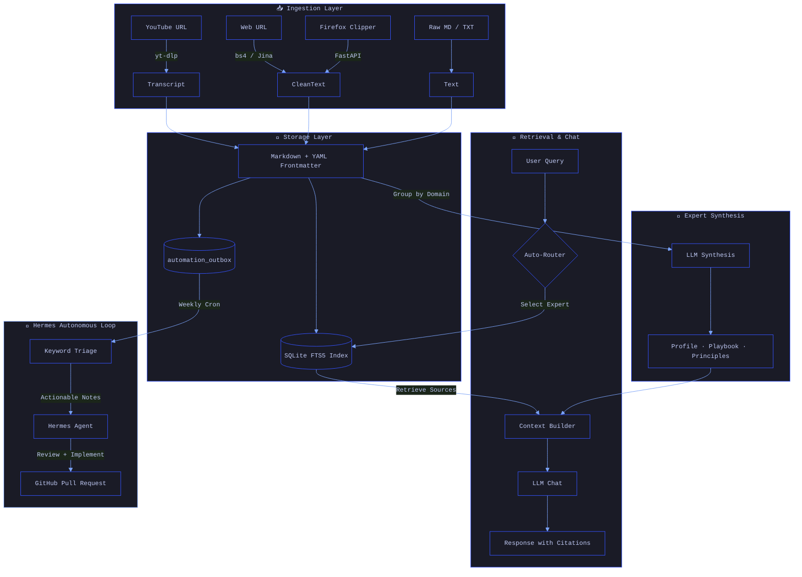

<p align="center">
  
</p>

<p align="center">
  <!-- The main UI hero shot -->
  
</p>

<p align="center">
  
  
  
  
  
</p>

<p align="center">
  <a href="#-getting-started">Getting Started</a> · <a href="#-architecture">Architecture</a> · <a href="#-autonomous-hermes-loop">Hermes Agent</a> · <a href="ROADMAP.md">Roadmap</a> · <a href="AGENTS.md">Agent Rules</a>
</p>

---

## What is LifeOS?

> **A personal knowledge-to-action platform.** Ingest notes, web pages, and YouTube transcripts → synthesize AI expert personas grounded in your data → then let an autonomous agent apply those insights back into the codebase as GitHub PRs.

Most AI tools stop at retrieval. **LifeOS closes the loop**: new knowledge becomes hypotheses, hypotheses become code changes, code changes become tested pull requests — all without manual intervention.

### ⚡ Key Capabilities

| Capability | Description |
|:-----------|:------------|
| **Expert Synthesis** | Groups content by creator/domain and auto-generates `playbook.md`, `principles.md`, and `profile.md` for each expert persona. |
| **Multi-Turn Chat with Citations** | Chat with your synthesized experts. Every claim is backed by a specific Markdown note reference. |
| **YouTube & Web Ingestion** | Drop a URL → LifeOS downloads the transcript or scrapes the page, summarizes it, and indexes it locally. |
| **Local SQLite FTS5 Search** | Lightning-fast, fully offline full-text indexing. No vector DB setup required. |
| **Autonomous Self-Improvement** | The [Hermes Agent](#-autonomous-hermes-loop) triages new notes for architecture/coding insights, reviews the codebase weekly, and opens GitHub PRs. |
| **Browser Clipper** | 1-click Firefox extension to capture any URL directly into your knowledge vault. |
| **Manual Personal Memory** | User-managed memory system to inject persistent context, preferences, and LLM expert exports directly into the system prompt. |
| **MCP Server** | Exposes `search_vault` and `get_note` tools via the [Model Context Protocol](https://modelcontextprotocol.io), so any MCP-compatible agent can query your knowledge base. |
| **Multi-Provider LLM** | Cascading fallback across Azure OpenAI → Gemini → OpenRouter. Swap models without code changes. |

#### 📚 Knowledge Vault & AI Summaries
The system automatically digests raw transcripts and articles into clean, actionable AI summaries.
<p align="center"></p>

#### 🧑‍🏫 Synthesized Expert Personas
LifeOS groups your insights by creator/domain and auto-generates deep, interactive expert personas (`profile`, `playbook`, `principles`).
<p align="center"></p>

#### 🎥 Automated Bulk Ingestion
Paste a YouTube Channel URL to instantly download recent transcripts, summarize them, and build an Expert profile in one click.
<p align="center"></p>

### 🔒 Privacy Model

LifeOS keeps **all data on your machine** — notes, indexes, expert profiles, and search stay in local SQLite and Markdown files. However, LLM inference (summarization, chat, expert synthesis) is processed via cloud APIs (Google Gemini, Azure OpenAI, or OpenRouter). Your data is sent to these providers for processing but is **never stored or trained on** by them. A future milestone ([Phase 4](ROADMAP.md)) adds full offline LLM support via Ollama.

---

## 🏗 Architecture



### System Design Principles

1. **Separation of Layers** — System code (`src/`, `apps/`, `config/`) is strictly separated from user data (`data/`). The application reads the User Layer to construct context but **never overwrites** human-written files without explicit approval.

2. **Expert Routing** — Queries are routed to the most relevant expert based on declarative mapping (`config/domain_map.yaml`) and frontmatter tags. Ask a design question → it goes to your design expert automatically.

3. **No Framework Lock-in** — Pure Python pipeline. No LangChain, no LlamaIndex. You own every prompt and every line of orchestration logic.

---

## 🤖 Autonomous Hermes Loop

LifeOS doesn't just store knowledge — it **acts on it**. The system features a decoupled, event-driven self-improvement pipeline:

```
┌─────────────┐    ┌──────────────┐    ┌──────────────┐    ┌─────────────┐
│  Note        │    │  Outbox      │    │  Triage      │    │  Hermes     │
│  Ingested    │───▶│  Queue       │───▶│  Worker      │───▶│  Agent      │
│              │    │  (SQLite)    │    │  (Keywords)  │    │  (oneshot)  │
└─────────────┘    └──────────────┘    └──────────────┘    └──────┬──────┘
                                                                  │
                                                    ┌─────────────▼──────────┐
                                                    │  • Reviews codebase    │
                                                    │  • Implements changes  │
                                                    │  • Runs pytest         │
                                                    │  • Opens GitHub PR     │
                                                    └────────────────────────┘
```

| Step | Component | What it does |
|:-----|:----------|:-------------|
| **1** | `src/core/ingest.py` | On every note save, pushes metadata to the `automation_outbox` table in SQLite. |
| **2** | `scripts/triage_outbox.py` | Lightweight keyword scanner (AI, Architecture, Python, SQLite, etc.). **No LLM calls** — runs in milliseconds. |
| **3** | `scripts/weekly_hermes_run.sh` | Cron-triggered weekly. Aggregates all actionable notes since the last run. |
| **4** | Hermes Agent | Receives the aggregated context, reviews the codebase via MCP tools, implements improvements, runs `pytest`, and opens a **GitHub Pull Request** for human approval. |

> **Why this design?** Calling an LLM on every single ingested note would be expensive and noisy. The outbox + keyword triage pattern keeps costs near-zero during normal operation, and batches the expensive Hermes review into a single weekly run.

---

## 🛡️ Agentic AI Security (OWASP 1.1)

LifeOS is designed with defense-in-depth against autonomous AI threats, specifically adhering to the **OWASP Agentic AI Threats and Mitigations 1.1** standard:

- **Memory Poisoning (LLM04):** LifeOS uses a strictly *manual* persistent memory injection system (`user_memory` table). Agents cannot autonomously overwrite your core preferences or system prompts, completely mitigating autonomous memory contamination.
- **Tool Misuse & Privilege Escalation (LLM02):** The Model Context Protocol (MCP) server runs in a highly restricted sandbox. It explicitly blocks path traversal and hard-denies access to `.env` and `data/private/`. External agents are granted **read-only** access by default.
- **Cascading Failures & Repudiation:** Every MCP tool invocation, including arguments and hidden Python exceptions, is securely logged to a private `mcp_audit.log`, ensuring full traceability of autonomous actions.
- **Denial of Service (LLM04):** The local MCP server enforces strict rate limiting (max 60 req/min) and truncates excessively long string inputs to prevent malicious agents from causing CPU exhaustion or Out-of-Memory crashes.

---

## 📁 Project Structure

```
lifeos/
├── apps/
│   ├── streamlit-chat/        # Main UI — app.py + modular ui/ components
│   └── firefox-clipper/       # 1-click browser extension for URL capture
├── src/
│   ├── api.py                 # FastAPI sidecar (receives clipped URLs)
│   └── core/                  # Pure Python business logic
│       ├── ingest.py          #   Orchestrates all resource ingestion
│       ├── frontmatter.py     #   YAML frontmatter read/write
│       ├── youtube.py         #   yt-dlp transcript downloading
│       ├── web.py             #   BeautifulSoup / Jina page scraping
│       ├── experts.py         #   Expert profile synthesis
│       ├── llm_client.py      #   Multi-provider LLM wrapper
│       ├── mcp_server.py      #   MCP server (search_vault, get_note)
│       └── build_fts_index.py #   SQLite FTS5 index builder
├── scripts/
│   ├── triage_outbox.py       # Keyword-based note triage (no LLM)
│   ├── weekly_hermes_run.py   # Weekly Hermes orchestrator
│   └── weekly_hermes_run.sh   # Cron entrypoint
├── config/                    # Domain maps, model definitions
├── data/                      # Your knowledge base (git-ignored)
│   ├── knowledge/             #   Ingested notes (Markdown)
│   ├── experts/               #   Synthesized expert profiles
│   └── private/               #   Personal backlog & sensitive data
├── tests/                     # pytest suite
├── docs/                      # Architecture docs, threat model, evals
├── AGENTS.md                  # Rules for AI coding agents
├── ROADMAP.md                 # Product roadmap by phase
└── .env.example               # Environment variable template
```

---

## 🧰 Tech Stack

| Layer | Technology | Purpose |
|:------|:-----------|:--------|
| **Search** | SQLite FTS5 | Full-text search over all ingested notes |
| **Storage** | Markdown + YAML frontmatter | Human-readable, git-friendly note format |
| **UI** | Streamlit | Multi-turn chat interface with expert routing |
| **API** | FastAPI + Uvicorn | Sidecar server for browser clipper ingestion |
| **LLM** | Azure OpenAI / Gemini / OpenRouter | Multi-provider with cascading fallback |
| **Agent** | Hermes Agent (MCP) | Autonomous codebase reviewer with PR creation |
| **Protocol** | Model Context Protocol (MCP) | Tool interface for external agents |
| **Ingestion** | yt-dlp, BeautifulSoup, Jina | YouTube transcripts, web scraping |
| **Testing** | pytest | Unit + integration test suite |

---

## 🚀 Getting Started

### Prerequisites
- Python 3.11+
- An API key for at least one LLM provider (Gemini, Azure OpenAI, or OpenRouter)

### 1. Clone & Install

```bash
git clone https://github.com/s-mberli/LifeOS.git
cd LifeOS
python -m venv .venv
source .venv/bin/activate
pip install -r requirements.txt
```

### 2. Configure Environment

```bash
cp .env.example .env
# Edit .env with your API keys
```

See [`.env.example`](.env.example) for all available configuration options including multi-provider LLM setup and GitHub token for the Hermes workflow.

### 3. Run the Chat UI

```bash
streamlit run apps/streamlit-chat/app.py
```

### 4. (Optional) Browser Clipper

Start the FastAPI sidecar to capture URLs from Firefox:

```bash
./start_api.sh
```

Then load the extension from `apps/firefox-clipper/` — see [its README](apps/firefox-clipper/README.md) for setup.

### 5. (Optional) Enable Hermes Autonomous Loop

1. Install the [Hermes Agent](https://github.com/hermes-agent/hermes)
2. Add your `GITHUB_TOKEN` to `.env`
3. The weekly cron job runs automatically every Sunday at midnight

---

## 🧪 Running Tests

```bash
source .venv/bin/activate
pytest
```

All core logic includes unit tests. External network and LLM calls are mocked. See [`AGENTS.md`](AGENTS.md) for contribution rules.

---

## 📋 Roadmap

See [**ROADMAP.md**](ROADMAP.md) for the full product roadmap. Current status:

- ✅ **Phase 1** — Ingestion & Expert Profiles (MVP)
- ✅ **Phase 2** — Testing, Refactoring & Cleanup
- 🔄 **Phase 3** — Enhanced Expert Management & Bulk Ingestion
- 🔮 **Phase 4** — Hybrid Retrieval & Offline LLMs

---

## 📄 License

This project is licensed under the [MIT License](LICENSE).

---

<p align="center">
  <sub>Built by <a href="https://github.com/s-mberli">@s-mberli</a> — a demonstration of end-to-end AI systems engineering.</sub>
</p>
