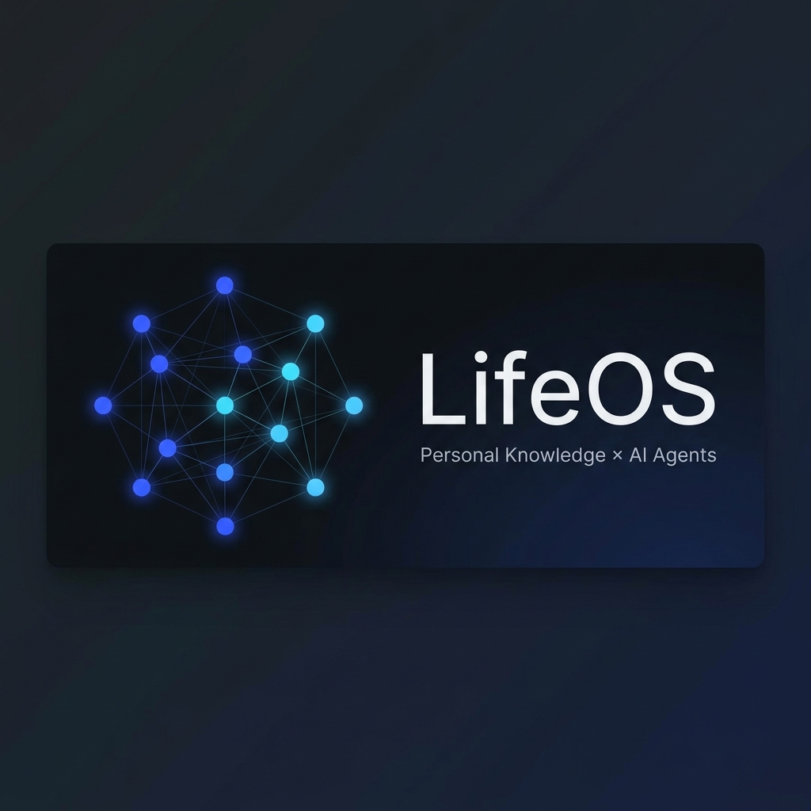
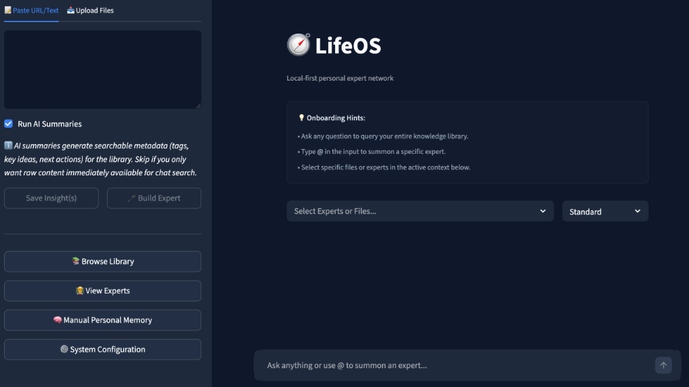
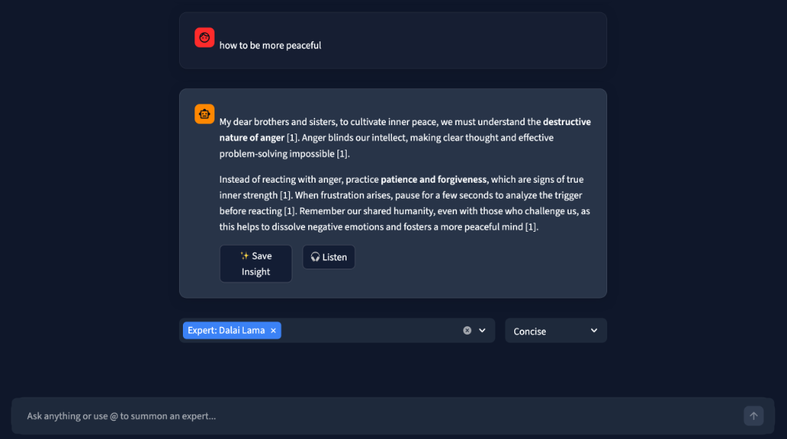
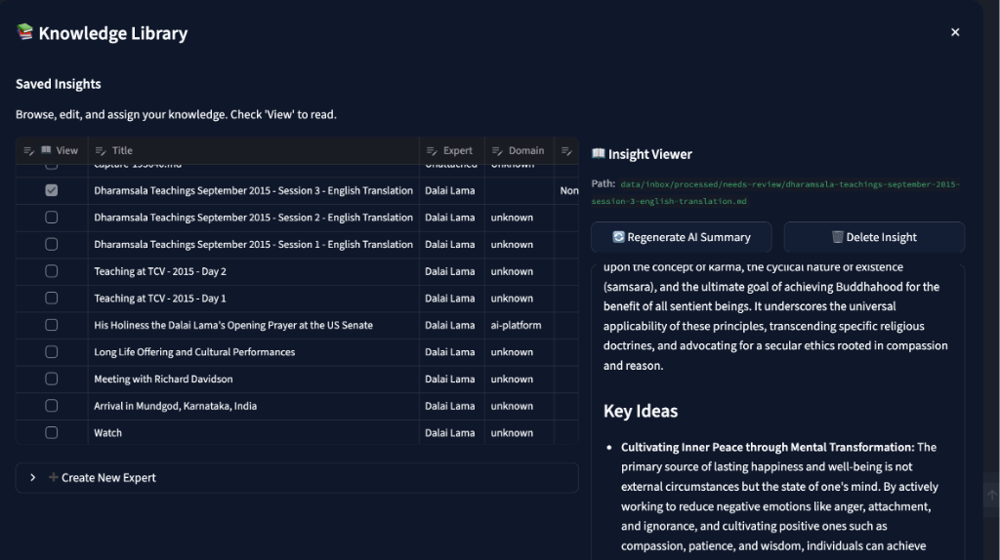
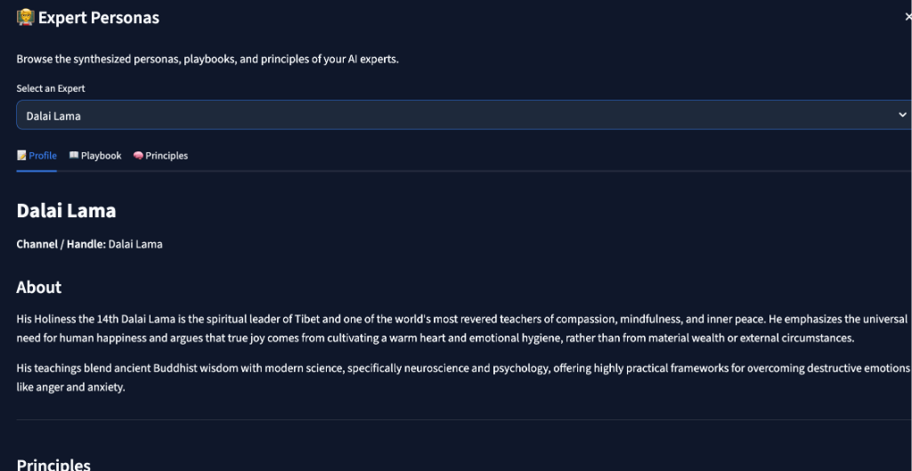
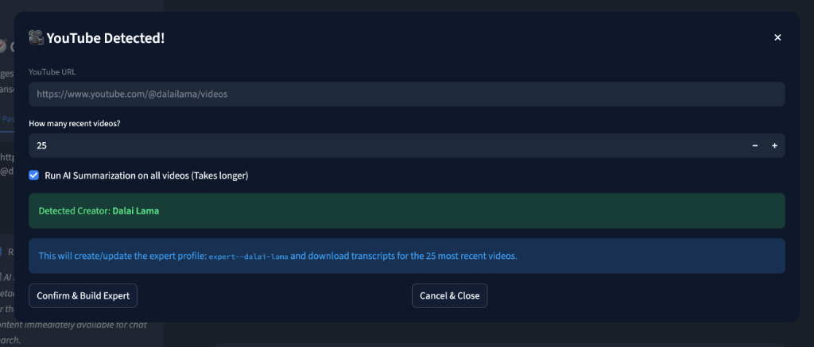
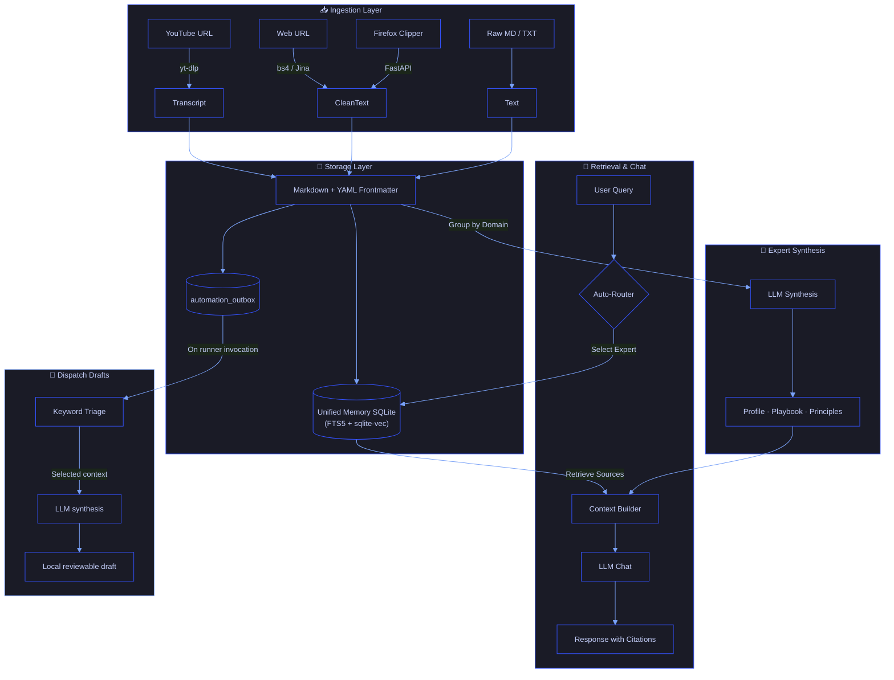

<p align="center">
  
</p>

<p align="center">
  <!-- The main UI hero shot -->
  
</p>

<p align="center">
  
  
  
  
  
</p>

<p align="center">
  <a href="#-getting-started">Getting Started</a> · <a href="#-architecture">Architecture</a> · <a href="#-dispatch-drafts">Dispatch Drafts</a> · <a href="ROADMAP.md">Roadmap</a> · <a href="docs/CLOUD-HANDOFF.md">Handoff</a>
</p>

---

## What is LifeOS?

> **A personal knowledge and expert chat system.** Ingest notes, web pages, and YouTube transcripts; organize them into searchable Markdown; synthesize expert profiles; and ask source-grounded questions.

The ingestion outbox can also inform dispatch drafts and architecture proposals for human review. The checked-in runner does not implement code changes or open GitHub pull requests. See the [cloud continuation guide](docs/CLOUD-HANDOFF.md) for verified status and gaps.

### ⚡ Key Capabilities

| Capability | Description |
|:-----------|:------------|
| **Expert Synthesis** | Groups content by creator/domain and auto-generates `playbook.md`, `principles.md`, and `profile.md` for each expert persona. |
| **Multi-Turn Chat with Citations** | Chat with your synthesized experts and inspect citations to the underlying Markdown notes. |
| **YouTube & Web Ingestion** | Drop a URL → LifeOS downloads the transcript or scrapes the page, summarizes it, and indexes it locally. |
| **Hybrid RAG & Vector Search** | Combines SQLite FTS5 keyword search and `sqlite-vec` semantic search via Reciprocal Rank Fusion (RRF). |
| **Reviewable Dispatch Drafts** | The [monthly runner](#-dispatch-drafts) triages notes and writes a local dispatch draft; a separate command can publish a previously reviewed draft when its source digest passes validation. |
| **Browser Clipper** | 1-click Firefox extension to capture any URL directly into your knowledge vault. |
| **Manual Personal Memory** | User-managed memory system to inject persistent context, preferences, and LLM expert exports directly into the system prompt. |
| **MCP Server** | Exposes `search_vault` and `read_vault_file` through the [Model Context Protocol](https://modelcontextprotocol.io) when configured. |
| **Multi-Provider LLM** | Cascading fallback across Azure OpenAI → Gemini → OpenRouter. Swap models without code changes. |
| **AI Code Review Tool** | A script can review supplied files and record provenance. Automatic enforcement across all contributions is not established. |
#### 💬 Multi-Turn Chat with Citations
Chat with your synthesized experts or your general knowledge base, then check important answers against their cited notes.
<p align="center"></p>

#### 📚 Knowledge Vault & AI Summaries
The system automatically digests raw transcripts and articles into clean, actionable AI summaries.
<p align="center"></p>

#### 🧑‍🏫 Synthesized Expert Personas
LifeOS groups your insights by creator/domain and auto-generates deep, interactive expert personas (`profile`, `playbook`, `principles`).
<p align="center"></p>

#### 🎥 Automated Bulk Ingestion
Paste a YouTube Channel URL to instantly download recent transcripts, summarize them, and build an Expert profile in one click.
<p align="center"></p>

#### 🛡️ AI Code Review Tool

`scripts/ai_code_reviewer.py` is an optional review tool for files you name. It records review data in SQLite. Its presence does not establish an automatic review or merge gate.

**How it works:**

The script reviews supplied paths across correctness, readability, architecture, security, and performance. Treat its output as review input and verify suggested changes and test results before merging.

**Usage:**
```bash
# Review a single file authored by Hermes
.venv/bin/python scripts/ai_code_reviewer.py Hermes src/core/new_feature.py

# Review multiple files
.venv/bin/python scripts/ai_code_reviewer.py Prototyper src/a.py src/b.py

```

See [`AGENTS.md`](AGENTS.md) for the current contributor workflow.

### 🔒 Privacy Model

Notes, indexes, and profiles are stored in local Markdown and SQLite files. Summarization, chat, and synthesis can send selected content to configured cloud LLM providers; review each provider's current data terms separately. Full offline inference is a future [roadmap](ROADMAP.md) item. Keep private data out of Git and inspect changes before staging.

---

## 🏗 Architecture


```mermaid
%%{init: {'theme':'base','themeVariables':{'primaryColor':'#1a1b26','primaryTextColor':'#c0caf5','primaryBorderColor':'#3553ff','lineColor':'#7aa2f7','fontFamily':'monospace','fontSize':'13px'}}}%%
flowchart TB
    subgraph Ingestion["📥 Ingestion Layer"]
        YT["YouTube URL"] --> |yt-dlp| Transcript
        Web["Web URL"] --> |bs4 / Jina| CleanText
        Clip["Firefox Clipper"] --> |FastAPI| CleanText
        Raw["Raw MD / TXT"] --> Text
    end

    subgraph Storage["💾 Storage Layer"]
        Transcript --> MD["Markdown + YAML Frontmatter"]
        CleanText --> MD
        Text --> MD
        MD --> DB[("Unified Memory SQLite<br>(FTS5 + sqlite-vec)")]
        MD --> Outbox[("automation_outbox")]
    end

    subgraph Experts["🧠 Expert Synthesis"]
        MD --> |Group by Domain| Synthesis["LLM Synthesis"]
        Synthesis --> Profile["Profile · Playbook · Principles"]
    end

    subgraph Chat["💬 Retrieval & Chat"]
        Query["User Query"] --> Router{"Auto-Router"}
        Router --> |Select Expert| DB
        DB --> |Retrieve Sources| Context["Context Builder"]
        Profile --> Context
        Context --> LLM["LLM Chat"]
        LLM --> Response["Response with Citations"]
    end

    subgraph Drafts["📝 Dispatch Drafts"]
        Outbox --> |On runner invocation| Triage["Keyword Triage"]
        Triage --> |Selected context| LLM2["LLM synthesis"]
        LLM2 --> Draft["Local reviewable draft"]
    end

    style Ingestion fill:#1a1b26,stroke:#3553ff,color:#c0caf5
    style Storage fill:#1a1b26,stroke:#3553ff,color:#c0caf5
    style Experts fill:#1a1b26,stroke:#3553ff,color:#c0caf5
    style Chat fill:#1a1b26,stroke:#3553ff,color:#c0caf5
    style Drafts fill:#1a1b26,stroke:#7aa2f7,color:#c0caf5
```

### System Design Principles

1. **Separation of Layers** — System code lives in `src/`, `apps/`, and `config/`; current application data belongs under `data/`. Some legacy top-level data remains to be inventoried and migrated.

2. **Expert Routing** — Domain mapping (`config/domain_map.yaml`) and frontmatter tags inform expert selection; check a cited answer against its source note.

3. **No Framework Lock-in** — Pure Python pipeline. No LangChain, no LlamaIndex. You own every prompt and every line of orchestration logic.

---

## 📝 Dispatch Drafts

Ingestion can queue note metadata in SQLite. `scripts/triage_outbox.py` scores queued notes, and `scripts/monthly_hermes_run.py` uses configured LLM access to write a local dispatch draft and optional proposal files. The default run saves the draft under `data/inbox/content_drafts/`; it does not publish. This runner uses a Hermes-themed prompt through LifeOS's LLM client, not the separately installed Hermes coding agent.

Publishing is a separate `--publish-draft PATH` invocation for an existing, reviewed draft. It checks the recorded source digest, its hash, and its age before the website publishing path can run. A draft made from fallback article collection has no eligible digest and cannot use this path. There is no checked-in process that implements code changes, runs tests, and opens a GitHub pull request from a proposal. Any deployed runner is a separate system; see the [cloud continuation guide](docs/CLOUD-HANDOFF.md) before assuming this checkout is deployed.

---

## 🛡️ Access Boundaries

The MCP tools accept only Markdown or text under `data/knowledge/` and `data/experts/`; private, inbox, raw, hidden, and symlinked paths are excluded. File reads and search responses are capped, with query rate and length checks. The browser clipper validates public HTTP(S) destinations and redirects before fetching bounded text. These safeguards are in the current local checkout and still require integration verification before exposing the MCP server to other agents. See the [cloud continuation guide](docs/CLOUD-HANDOFF.md) for test status and remaining limits.

---

## 📁 Project Structure

```
lifeos/
├── apps/
│   ├── streamlit-chat/        # Main UI — app.py + modular ui/ components
│   └── firefox-clipper/       # 1-click browser extension for URL capture
├── src/
│   ├── api.py                 # FastAPI sidecar (receives clipped URLs)
│   └── core/                  # Pure Python business logic
│       ├── ingest.py          #   Orchestrates all resource ingestion
│       ├── frontmatter.py     #   YAML frontmatter read/write
│       ├── youtube.py         #   yt-dlp transcript downloading
│       ├── web.py             #   BeautifulSoup / Jina page scraping
│       ├── experts.py         #   Expert profile synthesis
│       ├── llm_client.py      #   Multi-provider LLM wrapper
│       ├── mcp_server.py      #   MCP server (search_vault, read_vault_file)
│       └── build_fts_index.py #   SQLite FTS5 index builder
├── scripts/
│   ├── triage_outbox.py       # Keyword-based note triage (no LLM)
│   └── monthly_hermes_run.py  # Dispatch draft and reviewed publish command
├── config/                    # Domain maps, model definitions
├── data/                      # User data (private note paths ignored by Git)
│   ├── knowledge/             #   Ingested notes (Markdown)
│   ├── experts/               #   Synthesized expert profiles
│   └── private/               #   Personal backlog & sensitive data
├── tests/                     # pytest suite
├── docs/                      # Architecture docs, threat model, evals
├── AGENTS.md                  # Rules for AI coding agents
├── ROADMAP.md                 # Product roadmap by phase
└── .env.example               # Environment variable template
```

---

## 🧰 Tech Stack

| Layer | Technology | Purpose |
|:------|:-----------|:--------|
| **Search** | SQLite FTS5 + `sqlite-vec` | Hybrid keyword and semantic vector search over all notes |
| **Storage** | Markdown + YAML frontmatter | Human-readable, git-friendly note format |
| **UI** | Streamlit | Multi-turn chat interface with expert routing |
| **API** | FastAPI + Uvicorn | Sidecar server for browser clipper ingestion |
| **LLM** | Azure OpenAI / Gemini / OpenRouter | Multi-provider with cascading fallback |
| **Automation** | LifeOS runner | Local dispatch drafts and reviewed publication command |
| **Protocol** | Model Context Protocol (MCP) | Read-only vault tools for external agents, when configured |
| **Ingestion** | yt-dlp, BeautifulSoup, Jina | YouTube transcripts, web scraping |
| **Testing** | pytest | Unit + integration test suite |

---

## 🚀 Getting Started

### Prerequisites
- Python 3.11+
- An API key for at least one LLM provider (Gemini, Azure OpenAI, or OpenRouter)

### 1. Clone & Install

```bash
git clone https://github.com/s-mberli/LifeOS.git
cd LifeOS
python -m venv .venv
source .venv/bin/activate
pip install -r requirements.txt
```

### 2. Configure Environment

```bash
cp .env.example .env
# Edit .env with your API keys
```

See [`.env.example`](.env.example) for provider and optional integration settings. Keep the file local and review the destination and content before enabling website publication.

### 3. Run the Chat UI

```bash
streamlit run apps/streamlit-chat/app.py
```

### 4. (Optional) Browser Clipper

Start the FastAPI sidecar to capture URLs from Firefox:

```bash
./start_api.sh
```

Then load the extension from `apps/firefox-clipper/` — see [its README](apps/firefox-clipper/README.md) for setup.

### 5. (Optional) Generate a Dispatch Draft

Run `python scripts/monthly_hermes_run.py` after configuring a provider and source notes. Review the draft under `data/inbox/content_drafts/`. Publishing requires a separate `--publish-draft PATH` command and a matching recent source digest; see [Dispatch Drafts](#-dispatch-drafts). Scheduling and the separately installed Hermes agent require independent setup.

---

## 🧪 Running Tests

```bash
source .venv/bin/activate
pytest
```

The test suite contains unit and integration coverage; some tests depend on platform or local configuration. See the [cloud continuation guide](docs/CLOUD-HANDOFF.md) for the latest verified results and [`AGENTS.md`](AGENTS.md) for contribution rules.

---

## 📋 Roadmap

See [**ROADMAP.md**](ROADMAP.md) for the full product roadmap. Current status:

- ✅ **Phase 1** — Ingestion & Expert Profiles (MVP)
- ✅ **Phase 2** — Testing, Refactoring & Cleanup
- 🔄 **Phase 3** — Enhanced Expert Management & Bulk Ingestion
- 🔄 **Phase 4** — Hybrid Retrieval (sqlite-vec + FTS5 RRF) & Offline LLMs

---

## 📄 License

This project is licensed under the [MIT License](LICENSE).

---

<p align="center">
  <sub>Built by <a href="https://github.com/s-mberli">@s-mberli</a> — a demonstration of end-to-end AI systems engineering.</sub>
</p>


