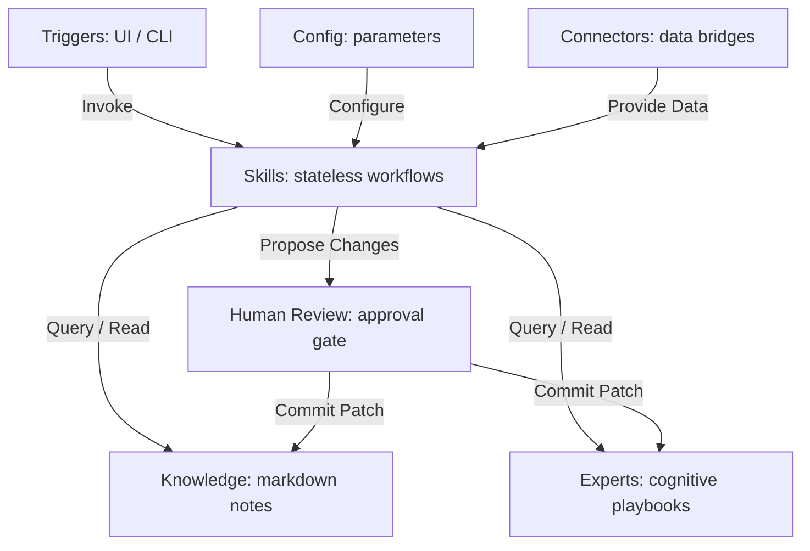

# Architecture Paradigm & Design Principles

LifeOS is architected as a **Local-first Personal Expert Network**. To make it scalable, clean, and easily packagable for a personal developer portfolio, it uses a modular paradigm consisting of seven core pillars:

---

## The Seven Pillars

### 1. Knowledge (Markdown)
The raw foundation of the system.
- **Form**: Markdown files with structured YAML frontmatter (e.g., `type: insight_note`).
- **Characteristics**: Immutable except when updated with status changes (e.g. `expert_status` or `attached_experts`). Decoupled entirely from specific experts or prompt contexts.

### 2. Experts (Cognitive Profiles)
Curated personas/perspectives that interpret Knowledge.
- **Form**: Directories containing `profile.md`, `playbook.md`, `principles.md`, and `sources/` containing `-ref.md` source references.
- **Characteristics**: Experts are **stateful cognitive prisms**. They do not hold raw content; they hold instructions on *how* to process knowledge attached to them.

### 3. Skills (Workflows)
Stateless, reusable computational actions.
- **Form**: Folders under `skills/` containing `SKILL.md` (contract/flow explanation) and `config.yml` (declarative parameters).
- **Characteristics**: Reusable pipelines. For example, `save-insight` downloads a transcript and formats an Insight Note. A skill has clear inputs and outputs but does not hold long-term state.

### 4. Config
Declarative files defining rules, system instructions, and LLM preferences.
- **Form**: `.env` and `skills/<skill_name>/config.yml`.
- **Characteristics**: Changes the behavior of Skills without modifying the underlying Python code.

### 5. Connectors
Bridges to external data sources.
- **Form**: Custom fetching functions (e.g., YouTube transcript down-loader, web-scrapers) embedded in ingest scripts.
- **Characteristics**: Converts external unformatted data into clean local markdown files.

### 6. Triggers
The entry points that start a Skill workflow.
- **Form**: Streamlit Web UI components or command line scripts.
- **Characteristics**: Captures user input and invokes the matching Skill.

### 7. Human Review
The ultimate safety gate.
- **Form**: Interactive UI panels (e.g. "Review Unattached Insights", "Expert Update suggestions") and status frontmatter (`pending_review`).
- **Characteristics**: Prevents autonomous writing of critical files. The system compiles suggestions, but the human user commits the change.

---

## Conceptual Folder Mapping

The codebase maps to the paradigm as follows:

- **`data/knowledge/`**: The Knowledge base.
- **`data/experts/`**: The Expert profiles.
- **`skills/`**: Stateless Skill declarations for `save-insight`, `attach-insight-to-expert`, `ask-expert`, `update-expert`, `review-unattached-insights`, and `generate-portfolio-case-study`.
- **`scripts/` & `apps/streamlit-chat/`**: Realizations of Skills, Connectors, and Triggers.
  - `apps/streamlit-chat/app.py` is the main **UI Trigger** and executes UI portions of `ask-expert`, `attach-insight-to-expert`, and `review-unattached-insights`.
  - `scripts/ingest_resource.py` is the execution engine for `save-insight`, `update-expert`, and backend portions of `review-unattached-insights`.
- **`config/`**: System-wide profiles and configurations.

