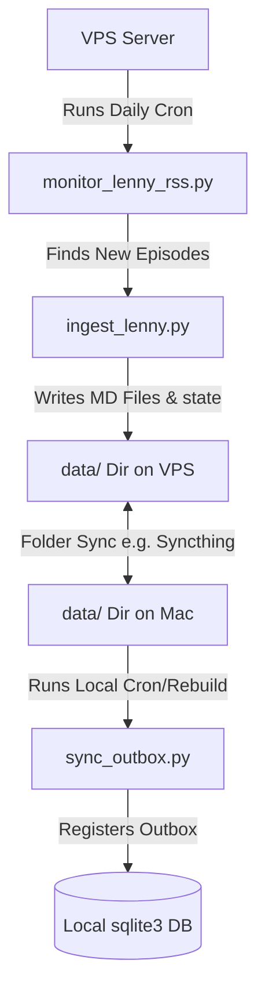

# VPS Deployment Guide for Lenny's Podcast RSS Automation

This guide explains how to set up the autonomous RSS feed crawler on your VPS and sync the results to your local Mac.

## Architecture Overview

MarkusOS uses a **Data-Only Sync** approach to keep databases localized while delegating crawler automations to a VPS.



1. **VPS (Crawler)**: Runs `scripts/monitor_lenny_rss.py` daily. If a new episode is detected in the RSS feed, it runs `scripts/ingest_lenny.py` on the VPS. New transcripts are saved in the shared `data/` directory.
2. **File Sync**: The shared `data/` directory (containing transcripts, topics, and `lenny_ingest.json`) is synced between the VPS and your local Mac (e.g. via Syncthing).
3. **Mac (Vault & Chat)**: A local script (`scripts/sync_outbox.py`) automatically detects newly synced transcripts, inserts them into the Mac's local `automation_outbox`, and FTS index builds make them searchable.

---

## Step 1: Set Up on the VPS

### 1. Clone the Codebase
Clone the MarkusOS repository (or configure your sync tool to mirror the files excluding the `.venv/` and `indexes/` directories).

### 2. Configure Virtual Environment & Dependencies
Set up the Python environment on your VPS:
```bash
cd markusos
python3 -m venv .env
.venv/bin/pip install -r requirements.txt
```

### 3. Create a Local `.env` (Optional)
If your VPS needs LLM/API access, copy the `.env.example` file to `.env` and fill in the keys. (Note: Lenny's ingestion script runs completely locally without calling LLM APIs to save costs).

---

## Step 2: Configure VPS Cron Job

We will use standard system `cron` to run the RSS monitor daily.

1. Open the crontab editor on your VPS:
   ```bash
   crontab -e
   ```

2. Add a cron entry to run the monitor script daily (e.g., at 10:00 AM):
   ```cron
   0 10 * * * cd /path/to/markusos && .venv/bin/python scripts/monitor_lenny_rss.py >> logs/lenny_rss_cron.log 2>&1
   ```

---

## Step 3: Configure Local Mac Sync & Rebuild

Once the VPS writes new transcripts to the shared `data/` directory, they sync to your Mac. To register them in your local outbox:

1. Open your Mac crontab:
   ```bash
   crontab -e
   ```

2. Add a cron entry to run the sync script daily (e.g., at 11:00 AM, shortly after the VPS run):
   ```cron
   0 11 * * * cd /path/to/markusos && .venv/bin/python scripts/sync_outbox.py >> logs/sync_outbox_cron.log 2>&1
   ```

*(Alternatively, the Streamlit sidebar contains a "Rebuild Search Index" button which will automatically index any new files found in your knowledge directory.)*
