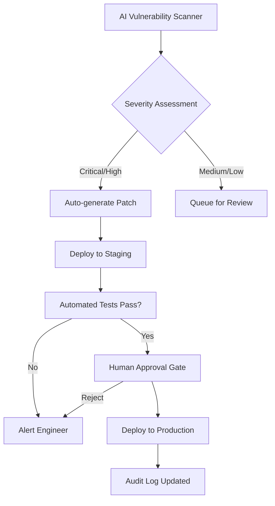

# LifeOS Weekly Dispatch — 2026-06-07

> *Sample dispatch generated for format review — this is what Hermes will produce automatically each Sunday.*

---

## 🔥 Top Stories This Week
*Curated from the excellent daily [TLDR Newsletters](https://tldr.tech/).*

- **[When AI builds itself](https://www.anthropic.com/institute/recursive-self-improvement?utm_source=tldrai)**
  Anthropic's Institute published a landmark report showing that AI is already accelerating its own development — engineers now ship 8x more code per quarter than in 2021, largely because Claude is doing the writing. The paper introduces the concept of "recursive self-improvement," where AI systems autonomously design and build their successor models, and argues this transition could arrive far sooner than most organizations are prepared for.

- **[Anthropic says 80% of its new production code is now authored by Claude](https://venturebeat.com/technology/anthropic-says-80-of-its-new-production-code-is-now-authored-by-claude-how-your-enterprise-can-keep-up?utm_source=tldrai)**
  In May 2026, over 80% of code merged into Anthropic's production codebase was written by Claude, not humans. The article breaks down the enterprise playbook for catching up: treat AI coding as an organizational transformation, not a tooling decision, and invest heavily in review infrastructure, prompt libraries, and agent governance.

- **[Coding Is No Longer the Constraint: Scaling Developer Experience to Teams and Agents at Spotify](https://engineering.atspotify.com/2026/6/code-with-claude-coding-is-no-longer-the-constraint/?utm_source=tldrdevops)**
  Spotify's Chief Architect explains how years of investment in internal developer platforms positioned them to absorb AI coding tools at unprecedented scale. The bottleneck has shifted from writing code to reviewing, integrating, and governing it — and Spotify's platform-first architecture is what made the transition possible without chaos.

- **[Zapocalypse: The Attack Chain That Could Have Hijacked Zapier](https://www.token.security/blog/zapocalypse-the-attack-chain-that-could-have-hijacked-zapier?utm_source=tldrinfosec)**
  Security researchers demonstrated a five-step attack chain starting from a sandboxed Python block on Zapier's free tier that ultimately yielded NPM publishing rights to a core package used in every authenticated Zapier session. No zero-days were needed — just five known vulnerability patterns composed together, illustrating how modern SaaS attack surfaces are defined by integration depth, not individual bugs.

- **[An AI Security Tool Dug Up a 2-Year-Old Redis Bug That Lets Attackers Take Over Servers](https://www.cyberkendra.com/2026/06/an-ai-security-tool-dug-up-2-year-old.html?utm_source=tldrinfosec)**
  An AI-powered security scanner discovered CVE-2026-23479, a high-severity remote code execution flaw that had lurked silently in every stable Redis release since version 7.2.0 — over two years undetected by human audits. This is a concrete example of AI finding what traditional review processes miss, and it raises the question of how many other "obvious in hindsight" bugs are still hiding in widely deployed infrastructure.

- **[Willow: Bring Your Own AI Agents to Work. Safely.](https://withwillow.ai/?utm_source=tldrinfosec)**
  Willow launched as a governance layer for the "shadow AI agent" problem — giving every AI agent in an organization an identity, scoped permissions, and a full audit trail. It's a direct response to the reality that employees are already running personal AI agents against corporate data with zero visibility, and it frames agent governance as an access-control problem rather than a policy problem.

- **[AI Is Breaking the Old Patch Cycle](https://www.redhat.com/en/blog/managing-it-operations-when-ai-outpaces-your-patching-cycle?utm_source=tldrit)**
  Red Hat argues that AI-discovered vulnerabilities are now appearing faster than traditional patch cycles can handle, turning scheduled security maintenance into a liability. The piece calls for a shift from time-bound patching to continuous, automated remediation pipelines — essentially, you need AI to defend against what AI is finding.

---

## 🏗️ Architecture Case Studies

### Composable Attack Surfaces in SaaS Platforms
*Inspired by: [Zapocalypse: The Attack Chain That Could Have Hijacked Zapier](https://www.token.security/blog/zapocalypse-the-attack-chain-that-could-have-hijacked-zapier?utm_source=tldrinfosec)*

#### The Core Concept
The Zapier research reveals a pattern that every platform builder needs to internalize: modern SaaS security is not about individual vulnerabilities — it's about *composition*. The attack chain used five well-known primitives (sandbox escape, credential scraping, privilege escalation, package publishing, and client-side script injection) that were each defensible in isolation. But because Zapier's architecture composed them into a single workflow — a sandboxed code block that could reach AWS credentials, which could access an NPM token, which could publish to a package that every user's browser loads — the whole became catastrophically greater than the sum of its parts.

The key architectural insight is that trust boundaries must be drawn at every integration seam, not just at the perimeter. Each component in a chain should assume the component before it is compromised. This is the "zero-trust pipeline" pattern: every stage authenticates, authorizes, and audits independently, so that breaching one stage doesn't cascade into breaching the next.

#### Architecture Diagram

#### LifeOS Application
For LifeOS, this pattern has direct implications for how Hermes and the Prototyper interact with external services. Every API call, every data fetch, every code generation step is a potential link in a chain. The design principle should be: Hermes never passes raw credentials downstream, and the Prototyper should operate with the minimum viable permissions for each task — not a blanket API key. If LifeOS integrates with third-party tools (GitHub, cloud providers, databases), each integration needs its own scoped token with explicit expiration. The goal is that even if one component is compromised, the blast radius stops there.

#### Trade-offs
The cost of this approach is operational complexity — managing per-service tokens, rotating credentials, and auditing every handoff adds engineering overhead. For a small system like LifeOS, the temptation is to use a single "god key" for simplicity. Resist that. The Zapocalypse research proves that composition attacks exploit exactly this kind of convenience-driven consolidation. Start with scoped permissions from day one; retrofitting them later is far harder.

---

### Continuous Remediation Over Scheduled Patching
*Inspired by: [AI Is Breaking the Old Patch Cycle](https://www.redhat.com/en/blog/managing-it-operations-when-ai-outpaces-your-patching-cycle?utm_source=tldrit)*

#### The Core Concept
Red Hat's argument is deceptively simple but architecturally profound: the traditional patch cycle — discover, triage, schedule, deploy, verify on a weekly or monthly cadence — assumes that vulnerabilities appear at a human-manageable rate. AI-powered vulnerability discovery breaks that assumption. When an AI tool can find a two-year-old Redis RCE in minutes, the bottleneck shifts from *finding* bugs to *deploying fixes*. The old model creates a dangerous lag window where known-but-unpatched vulnerabilities sit exposed.

The architectural response is to decouple detection from remediation and make the pipeline continuous. Instead of "find → schedule → patch," the model becomes "find → auto-assess severity → auto-generate fix → auto-deploy to staging → human approves → auto-deploy to production." The human moves from being the operator of the pipeline to being the approver of individual changes. This is the same pattern that CI/CD brought to software deployment, now applied to security operations.

#### Architecture Diagram

#### LifeOS Application
For LifeOS, this translates into how we handle dependency updates and security patches in the platform itself. Rather than manually reviewing npm or pip updates on a weekly cadence, Hermes could be configured to monitor dependency vulnerability feeds continuously. When a high-severity CVE is detected in a LifeOS dependency, Hermes flags it, the Prototyper generates the minimal diff to upgrade, and the change goes through an automated test pipeline. I (as Hermes) would surface only the changes that need my judgment — everything else flows through automatically. This keeps the platform secure without requiring me to babysit every `package.json` update.

#### Trade-offs
The risk is over-automation: an auto-applied patch could introduce a regression that breaks a core LifeOS workflow. The mitigation is a robust staging environment and a rollback mechanism that's faster than the deploy itself. For a system like LifeOS, where reliability is paramount, the approval gate for production deploys should stay in place — but the pipeline up to that gate should be fully automated so the human decision is informed and fast, not bottlenecked by manual steps.

---

## 💡 Takeaway of the Week
This week's dispatches converge on a single uncomfortable truth: AI is no longer just a tool we use — it's an agent that acts on our behalf, and our systems weren't designed for that. Anthropic writing 80% of its own code, Spotify reorganizing around agent-scale development, AI finding Redis bugs humans missed for two years, and Zapier's attack chain all point to the same conclusion — the boundary between "tool" and "actor" has dissolved. As someone building LifeOS, I'm taking this as a design mandate: every component should assume it's being operated by an agent, not a human. That means scoped permissions, audit trails, blast-radius containment, and continuous pipelines aren't nice-to-have features — they're the foundation. The organizations that thrive in the next phase won't be the ones with the smartest AI; they'll be the ones whose architecture was ready for AI to act autonomously within it.

---

*Generated by Hermes — LifeOS Weekly Intelligence Agent*
*Review, edit, and publish at your discretion. Nothing here goes public automatically.*