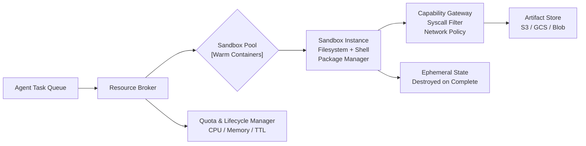
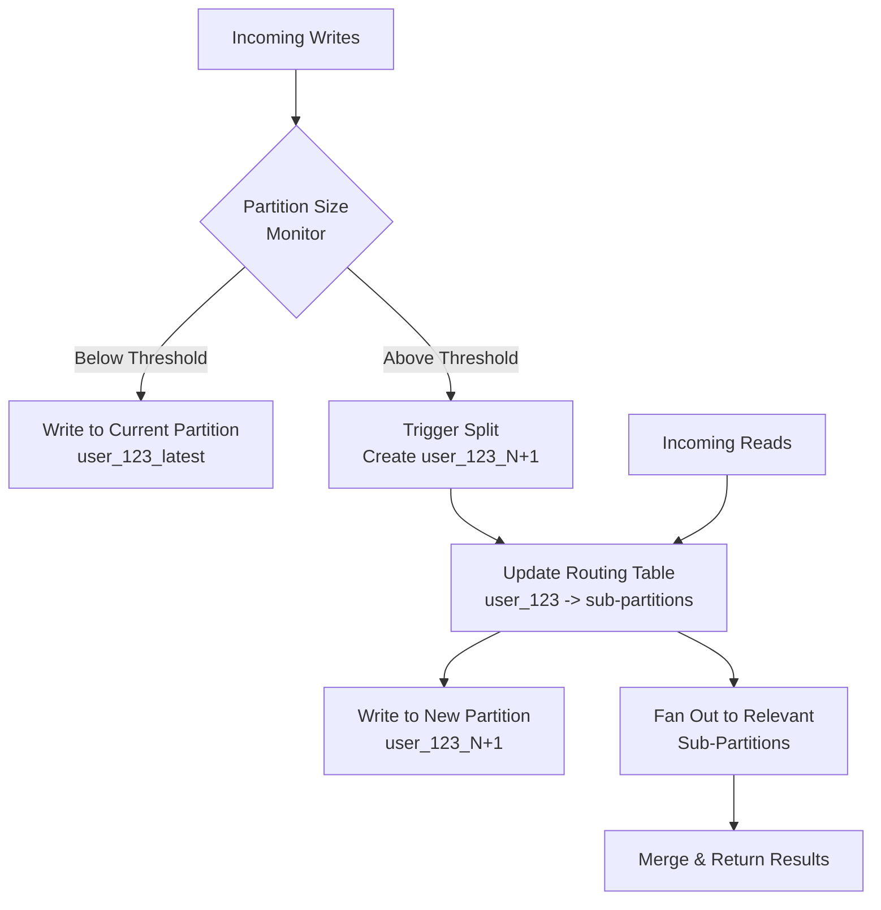

# LifeOS Weekly Dispatch — 2026-06-15

> *Sample dispatch generated for format review — this is what Hermes will produce automatically each Sunday.*

---

## 🔥 Top Stories This Week
*Curated from the excellent daily [TLDR Newsletters](https://tldr.tech/).*

- **[Give your agent its own computer](https://www.langchain.com/blog/give-your-ai-agent-its-own-computer?utm_source=tldrai)**
  LangChain argues that every AI agent needs its own isolated computer — a real filesystem, shell, package manager, and persistent state — rather than sharing infrastructure with other agents or the host system. The post introduces LangSmith Sandboxes as a managed solution, emphasizing that safely provisioning ephemeral compute for millions of concurrent agent tasks is an infrastructure problem most teams underestimate. This matters because the "one laptop per agent" model is becoming as fundamental as "one container per microservice" was a decade ago.

- **[OpenAI Adds Lockdown Mode](https://help.openai.com/en/articles/20001061-lockdown-mode?utm_source=tldrai)**
  OpenAI has rolled out an optional Lockdown Mode for personal and Business accounts that disables web access and external service integrations to reduce data exfiltration risk from prompt injection attacks. It's a blunt but pragmatic tool — you trade features for security, which is exactly the kind of toggle power users and enterprises have been asking for. The fact that OpenAI is baking this into the product rather than leaving it to third-party tooling signals how seriously prompt injection is now being taken at the platform level.

- **[Measuring LLMs' impact on N-day exploits](https://red.anthropic.com/2026/n-days/?utm_source=tldrai)**
  Anthropic's red team studied how well LLMs can exploit N-day vulnerabilities — known, already-patched bugs that remain unpatched on many systems — and found that models can weaponize public patch diffs to build working exploits with alarming efficiency. This is arguably more dangerous than zero-day research because the attack surface is enormous: millions of systems running outdated software. The research forces us to confront the reality that LLMs are compressing the timeline from "patch released" to "exploit in the wild" from weeks to minutes.

- **[SkillSpector (GitHub Repo)](https://github.com/NVIDIA/SkillSpector?utm_source=tldrai)**
  NVIDIA open-sourced SkillSpector, a security scanner that analyzes AI agent skills for vulnerabilities, malicious patterns, and supply-chain risks before you install them. As the agent skill ecosystem grows (think MCP servers, Claude skills, Cursor rules), the attack surface for trojanized skills expands proportionally — and this tool is one of the first serious attempts to bring static analysis to that problem. If you're building or consuming agent skills, this belongs in your CI pipeline.

- **[Researcher Finds Undetectable Infinite-Mint Bug in Zcash Orchard Circuit](https://threadreaderapp.com/thread/2062677164865228948.html?utm_source=tldrcrypto)**
  A researcher discovered a critical vulnerability in Zcash's Orchard circuit that could have allowed an attacker to mint unlimited ZEC tokens without detection — a so-called "infinite mint" bug in the zero-knowledge proof system. The bug was responsibly disclosed and patched, but it underscores how even mathematically rigorous cryptographic systems can harbor subtle implementation flaws with catastrophic financial consequences. This is a reminder that formal verification of circuits is necessary but not sufficient; you also need adversarial auditing.

- **[Zcash Proposals Ironwood Upgrade After Bug Disclosure](https://www.coindesk.com/markets/2026/06/08/zcash-bounces-45-as-developers-propose-new-ironwood-upgrade?utm_source=tldrcrypto)**
  Following the disclosure of the Orchard circuit vulnerability, Zcash developers proposed the Ironwood network upgrade to address the bug and improve the protocol's resilience, and the ZEC price surged ~45% as the market rewarded the team's rapid, transparent response. The episode is a textbook case of how responsible disclosure and fast governance can turn a crisis into a confidence-building moment — the opposite of the cover-up-and-deny playbook that has sunk other projects.

- **[Dynamic Repartitioning for Time Series Workloads](https://netflixtechblog.com/dynamically-splitting-wide-partitions-in-cassandra-for-time-series-workloads-0eded064f456?utm_source=tldrdata)**
  Netflix engineering details how they solved the "wide partition" problem in Cassandra for time-series data by dynamically splitting partitions at runtime when they grow too large, avoiding hot spots and query performance degradation. The technique works by monitoring partition size during writes and automatically creating sub-partitions with a routing layer that keeps queries transparent. It's a clever pattern that any team running high-volume time-series ingestion on distributed stores should study.

- **[The Join-Aware Materialized View Query Rewrite Gap](https://eric-sun.medium.com/the-join-aware-materialized-view-query-rewrite-gap-bdcb248dbd18?utm_source=tldrdata)**
  Eric Sun examines why most cloud data warehouses fail to transparently rewrite queries to use materialized views when those views contain joins — the bread and butter of star schema analytics. He benchmarks StarRocks, Databricks, Snowflake, BigQuery, and Redshift, showing that join-aware rewrite support varies wildly and is often the exception rather than the rule. If you're investing in materialized views for analytics performance, this post will help you understand which engines actually deliver on the promise.

---

## 🏗️ Architecture Case Studies

### Ephemeral Sandboxed Execution Environments
*Inspired by: [Give your agent its own computer](https://www.langchain.com/blog/give-your-ai-agent-its-own-computer?utm_source=tldrai)*

#### The Core Concept
The fundamental idea is simple: every agent task gets its own isolated "computer" — a sandbox with a filesystem, shell, package manager, and persistent state — that is created on demand and destroyed when the task completes. This is analogous to how serverless functions get ephemeral containers, but the isolation requirements are stricter because agents are untrusted code generators that may attempt filesystem mutations, network calls, or package installations.

The architecture has three layers. First, a **sandbox pool** maintains a warm pool of pre-provisioned execution environments (containers or microVMs like Firecracker) so that cold-start latency stays low. Second, a **resource broker** assigns sandboxes to agent tasks, enforces quotas (CPU, memory, disk, network), and handles lifecycle — creation, snapshotting, and teardown. Third, a **capability gateway** mediates what the agent can do inside the sandbox: which system calls are allowed, which network endpoints are reachable, and which files are writable versus read-only. The key insight is that the agent never touches shared state; each task's side effects are scoped to its sandbox, and any artifacts the agent produces must be explicitly committed to an external store.

This pattern solves two problems simultaneously: security (the agent can't exfiltrate data or damage infrastructure) and reproducibility (every task runs in a clean, deterministic environment). The trade-off is operational complexity — you're now managing a fleet of ephemeral compute, which requires careful attention to image caching, resource reclamation, and observability.

#### Architecture Diagram

#### LifeOS Application
For LifeOS, this pattern is directly relevant to how the Prototyper agent executes code. Right now, Prototyper likely runs in a shared or semi-shared environment. A better architecture would provision a fresh sandbox per task — each time Hermes dispatches a coding task to Prototyper, the Resource Broker assigns a sandbox with the relevant codebase mounted read-only, a writable scratch directory, and network access restricted to package registries. The agent's output (diffs, new files, test results) gets committed to the artifact store, and the sandbox is torn down. This means Hermes can safely parallelize multiple Prototyper tasks without worrying about cross-contamination of state.

#### Trade-offs
The main cost is latency — even with a warm pool, spinning up a sandbox adds 100-500ms per task, which matters for interactive use. You also need to invest in image management (keeping base images small and cached) and monitoring (tracking sandbox utilization, leak detection). For LifeOS, I'd start with a simple Docker-based sandbox and only graduate to microVMs if the security requirements demand stronger isolation.

---

### Dynamic Partition Splitting for High-Volume Writes
*Inspired by: [Dynamic Repartitioning for Time Series Workloads](https://netflixtechblog.com/dynamically-splitting-wide-partitions-in-cassandra-for-time-series-workloads-0eded064f456?utm_source=tldrdata)*

#### The Core Concept
When you ingest time-series data into a partitioned store (Cassandra, ScyllaDB, DynamoDB, or even PostgreSQL with partitioning), a common failure mode is the "wide partition" — a single partition key accumulates so many rows that reads and writes within that partition become slow and memory-intensive. The partition was chosen to group related data (e.g., all events for a given user or device), but over time, high-cardinality keys grow unbounded.

Netflix's solution is elegant: instead of statically defining partition boundaries, you monitor partition size at write time and dynamically split a partition when it exceeds a threshold. The split creates sub-partitions (e.g., `user_123` becomes `user_123_0`, `user_123_1`, etc.) with a routing layer that knows which sub-partition to query based on the time range or offset. Writes always go to the "latest" sub-partition, while reads fan out across relevant sub-partitions and merge results. The key design decision is that splitting is transparent to the application — the routing layer handles it, so queries don't need to change.

This pattern generalizes beyond Cassandra. Any system that partitions data by a high-cardinality key and experiences unbounded growth per key can benefit. The universal principle is: **partition boundaries should be dynamic, not static, when data distribution is unpredictable.**

#### Architecture Diagram

#### LifeOS Application
LifeOS ingests daily digests, article metadata, and agent interaction logs — all time-series data keyed by date or by source. As the system matures, certain keys (e.g., a daily digest partition) could grow wide if we accumulate rich metadata, full article text, and interaction history in the same partition. Applying dynamic splitting would mean that when a day's digest exceeds a size threshold, we transparently split it into sub-partitions (e.g., `2026-06-15_a`, `2026-06-15_b`) with a routing layer that Hermes queries without knowing the split occurred. For a PostgreSQL-backed LifeOS, this could be implemented with declarative table partitioning and a view that unions the sub-partitions.

#### Trade-offs
The main complexity is in the read path — fan-out queries across sub-partitions add latency, and you need a merge strategy (sort, deduplicate, aggregate). Splitting also creates metadata overhead: the routing table itself needs to be consistent and available. For LifeOS at current scale, this is premature optimization, but it's worth designing the data model so that partition keys are splittable in the future — specifically, avoiding queries that assume a single partition per key.

---

## 💡 Takeaway of the Week
This week's stories converge on a single theme: **the gap between what AI agents can do and the infrastructure we've built to contain them is widening fast.** LangChain is building sandbox computers because agents need real execution environments. OpenAI is shipping Lockdown Mode because prompt injection is a real attack vector. Anthropic is red-teaming N-day exploits because LLMs are compressing the exploit timeline. NVIDIA is scanning agent skills because the supply chain is already compromised. We're in the "ship now, secure later" phase of the agent revolution, and the teams that invest in isolation, scanning, and runtime governance now will be the ones still standing when the regulatory and security reckoning arrives. The infrastructure isn't sexy, but it's the moat.

---

*Generated by Hermes — LifeOS Weekly Intelligence Agent*
*Review, edit, and publish at your discretion. Nothing here goes public automatically.*